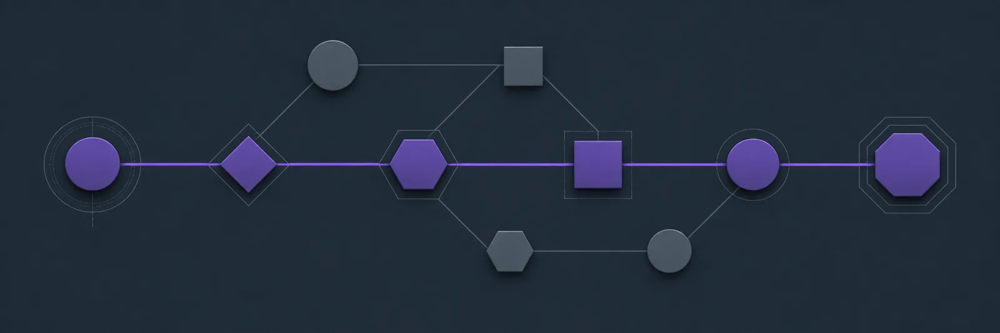

[← All systems](https://github.com/J0UH) · [Agentic systems](https://github.com/J0UH/agentic-systems)

<p align="center">
  
</p>

# Project intelligence and coordination

Complex work becomes easier to steer when decisions, dependencies, evidence, ownership, and next actions live in one reliable project picture. People remain responsible while assistants help keep that picture current and useful.

## The engineering problem

Agents lose context and project tools lose reasoning. Atlas joins the two while keeping authority with the team. The system has to know what changed, which evidence supports it, and when to stop for a decision.


## What the system covers

- Project and task domain modelling
- Durable agent and human state
- Evidence-linked decisions
- Work routing and review
- Role and authority boundaries
- Operational dashboards

## System shape

```mermaid
flowchart TD
accTitle: Project intelligence and coordination
accDescr: Project sources form a dependency graph that guides agent proposals. A person gates state-changing tools, and new evidence can recompute the graph instead of freezing an obsolete plan.
    sources["Project sources"] --> graph["Dependency graph"]
    graph --> route["Agent routing"]
    route --> proposal["Proposed state change"]
    proposal --> authority{"Human authority?"}
    authority -->|Approved| tools["Bounded tools"]
    authority -->|Revise| graph
    tools --> evidence["Evidence ledger"]
    evidence -->|New dependency| graph
```

## Build notes

- Store decisions separately from conversation history.
- Let agents propose state changes through bounded tools.
- Make blockers and uncertainty visible instead of manufacturing progress.

<sub>Public overview only. Source code, customer data, credentials, and private operating details are not included.</sub>

## Talk through a similar problem

Working on something similar? [Tell me about it](mailto:ju@jomena.group?subject=Project%20intelligence%20and%20coordination).
