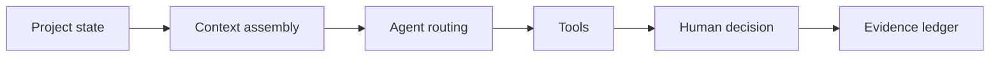

  

# Atlas project intelligence

Atlas turns project work into a system an agent can reason about without replacing the people responsible for it. The useful unit is not a chat message. It is durable project state with ownership, evidence, dependencies, and a clear next action.

[Discuss a similar system](mailto:ju@jomena.group?subject=Discuss%20Atlas%20project%20intelligence) | [Book a technical call](mailto:ju@jomena.group?subject=Book%20a%20technical%20call%20about%20Atlas%20project%20intelligence)

## The engineering problem

Agents lose context and project tools lose reasoning. Atlas joins the two while keeping authority with the team. The system has to know what changed, which evidence supports it, and when to stop for a decision.

## What the system covers

- Project and task domain modelling
- Durable agent and human state
- Evidence-linked decisions
- Work routing and review
- Role and authority boundaries
- Operational dashboards

## System shape

## Build notes

- Store decisions separately from conversation history.
- Let agents propose state changes through bounded tools.
- Make blockers and uncertainty visible instead of manufacturing progress.

Built under the Aryze umbrella. The underlying source and company IP remain private and owned by Aryze. Delivery involved people across engineering, product, operations, compliance, and design. Open-source foundations retain their original attribution and licences.

## Talk through a similar problem

If you are trying to build, untangle, or ship a system in this area, [send me a note](mailto:ju@jomena.group?subject=I%20need%20help%20with%20Atlas%20project%20intelligence). If the problem needs a deeper technical conversation, [book a call by email](mailto:ju@jomena.group?subject=Book%20a%20technical%20call%20about%20Atlas%20project%20intelligence).
